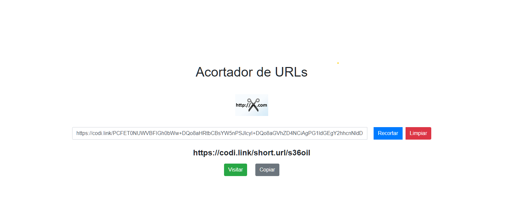

# 🔗 Acortador de URLs

# 🎓 Acortador de URLs: Un Proyecto Educativo de Desarrollo Web

## 📚 Introducción

El Acortador de URLs es un proyecto práctico diseñado para introducir a estudiantes y desarrolladores principiantes en los fundamentos del desarrollo web moderno. Este proyecto, aunque simple en su concepto, integra múltiples tecnologías y conceptos fundamentales de la programación web, haciéndolo ideal como herramienta de aprendizaje.

### 🤔 ¿Por qué este proyecto es valioso para el aprendizaje?

1. **🛠️ Integración de Tecnologías Fundamentales:**
   - **🌐 HTML5:** Aprende estructura semántica y mejores prácticas de marcado
   - **🎨 CSS3:** Experimenta con diseño responsive y flexbox
   - **⚡ JavaScript:** Practica manipulación del DOM y gestión de eventos
   - **🎯 Bootstrap:** Introducción a frameworks CSS populares

2. **💡 Conceptos Clave Cubiertos:**
   - 🔄 Manipulación del DOM
   - 🎮 Manejo de eventos
   - 📱 Diseño responsive
   - 📋 Integración de APIs del navegador (clipboard)
   - 🔍 URL parsing y manipulación
   - 🎲 Generación de identificadores únicos
   - 👥 Interfaz de usuario intuitiva

3. **🎯 Habilidades Desarrolladas:**
   - 🧠 Pensamiento lógico en programación
   - 🎨 Diseño de interfaces de usuario
   - 🐛 Debugging y resolución de problemas
   - 🔧 Uso de herramientas de desarrollo web
   - 🏗️ Comprensión de arquitectura frontend

## 💫 Valor Educativo

### 👨‍🎓 Para Estudiantes
- **🏗️ Proyecto Completo:** Experiencia práctica en crear una aplicación web funcional de principio a fin
- **✨ Código Limpio:** Ejemplos de buenas prácticas de codificación y estructura de proyecto
- **🎯 Fundamentos Sólidos:** Base para comprender conceptos más avanzados
- **🚀 Resultados Inmediatos:** Motivación al ver resultados tangibles rápidamente

### 👨‍🏫 Para Educadores
- **📚 Material Didáctico:** Excelente ejemplo para enseñar conceptos web básicos
- **🔧 Personalizable:** Fácil de extender con nuevas características para ejercicios
- **🧩 Modular:** Puede dividirse en lecciones más pequeñas
- **💼 Práctico:** Demuestra casos de uso del mundo real

### 🎯 Para Autodidactas
- **📂 Proyecto Inicial:** Perfecto para construir un portfolio
- **📈 Escalable:** Posibilidad de agregar nuevas características
- **📝 Documentado:** Código comentado y explicado
- **🆓 Independiente:** No requiere backend para funcionar

## 🖼️ Previsualización del Proyecto



## 📋 Características

- 🎯 Interfaz de usuario intuitiva y responsive
- ⚡ Generación rápida de URLs cortas
- 📋 Botón de copia al portapapeles
- 🔗 Botón para visitar la URL original
- 🎨 Diseño moderno con Bootstrap 4

## 🛠️ Tecnologías Utilizadas (Explicadas)

### 🖥️ Frontend
- **🌐 HTML5**
  - Lenguaje de marcado para estructurar el contenido
  - Uso de elementos semánticos modernos
  - Integración con CSS y JavaScript

- **🎨 CSS3**
  - Estilos modernos y responsive
  - Uso de Flexbox para layouting
  - Media queries para adaptabilidad

- **⚡ JavaScript (Vanilla)**
  - Manipulación del DOM
  - Manejo de eventos
  - Generación de URLs cortas
  - Funciones de utilidad

### 📚 Frameworks y Librerías
- **🅱️ Bootstrap 4.5.2**
  - Framework CSS para diseño responsive
  - Componentes predefinidos
  - Grid system
  - Estilos consistentes

- **💫 jQuery 3.5.1**
  - Simplifica la manipulación del DOM
  - Compatible con navegadores antiguos
  - Base para plugins Bootstrap

- **🎯 Popper.js 2.5.4**
  - Manejo de posicionamiento de elementos
  - Requerido por Bootstrap

## 📁 Estructura del Proyecto

```
acortador-urls/
├── 📄 index.html
├── 🎨 styles.css
└── ⚡ script.js
```

## 💻 Instalación

1. 📥 Clona este repositorio:
```bash
git clone https://github.com/tu-usuario/acortador-urls.git
```

2. 📂 Navega al directorio del proyecto:
```bash
cd acortador-urls
```

3. 🌐 Abre `index.html` en tu navegador web preferido.

## 🔧 Código Principal

### 📄 HTML (index.html)
```html
<!DOCTYPE html>
<html lang="es">
<head>
    <meta charset="UTF-8">
    <meta name="viewport" content="width=device-width, initial-scale=1.0">
    <link rel="shortcut icon" href="https://files.softicons.com/download/system-icons/lozengue-filetype-icons-by-gurato/ico/URL.ico" type="image/x-icon">
    <title>Acortador de URLs</title>
    <link rel="stylesheet" href="https://stackpath.bootstrapcdn.com/bootstrap/4.5.2/css/bootstrap.min.css">
    <link rel="stylesheet" href="styles.css">
</head>
<body>
    <div class="container text-center">
        <h1 class="my-4">Acortador de URLs</h1>
        
        <div class="input-group mb-3">
            <input type="text" class="form-control" id="longUrl" placeholder="Pega tu URL larga aquí">
            <div class="input-group-append">
                <button class="btn btn-primary" onclick="shortenUrl()">Recortar</button>
            </div>
        </div>
        <div id="result" class="mt-3">
            <p id="shortUrl" class="h4"></p>
            <button id="visitButton" class="btn btn-success" style="display: none;" onclick="openInNewTab()">Visitar</button>
            <button id="copyButton" class="btn btn-secondary" style="display: none;" onclick="copyToClipboard()">Copiar</button>
        </div>
    </div>
    <script src="https://code.jquery.com/jquery-3.5.1.slim.min.js"></script>
    <script src="https://cdn.jsdelivr.net/npm/@popperjs/core@2.5.4/dist/umd/popper.min.js"></script>
    <script src="https://stackpath.bootstrap.com/4.5.2/js/bootstrap.min.js"></script>
    <script src="script.js"></script>
</body>
</html>
```

### 🎨 CSS (styles.css)
```css
/* Estilo general del cuerpo de la página */
body {
    font-family: Arial, sans-serif; /* Fuente Arial para el texto */
    display: flex; /* Usar flexbox para el diseño */
    flex-direction: column; /* Dirección del eje principal (columna) */
    align-items: center; /* Centrar elementos horizontalmente */
    justify-content: center; /* Centrar elementos verticalmente */
    height: 100vh; /* Altura de la vista del navegador */
    margin: 0; /* Eliminar margen predeterminado */
}

/* Estilo para la imagen del logo */
img {
    margin: 20px 0; /* Espaciado superior e inferior */
}

/* Estilo para inputs y botones */
input, button {
    margin: 10px; /* Espaciado alrededor */
    padding: 10px; /* Relleno interno */
    font-size: 16px; /* Tamaño de la fuente */
}

/* Estilo para el texto de la URL acortada */
#shortUrl {
    font-weight: bold; /* Texto en negrita */
}
```

### ⚡ JavaScript (script.js)
```javascript
// Función para acortar la URL
function shortenUrl() {
    // Obtiene la URL larga desde el input
    const longUrl = document.getElementById('longUrl').value;
    
    // Verifica que la URL no esté vacía
    if (longUrl) {
        // Crea un objeto URL para extraer el dominio
        const url = new URL(longUrl);
        const domain = url.hostname;
        
        // Genera un ID único para la URL acortada
        const uniqueId = Math.random().toString(36).substring(2, 8);
        
        // Crea la URL acortada
        const shortUrl = `https://${domain}/short.url/${uniqueId}`;

        // Muestra la URL acortada en el elemento con id 'shortUrl'
        document.getElementById('shortUrl').innerText = shortUrl;
        
        // Muestra los botones 'Visitar' y 'Copiar'
        document.getElementById('visitButton').style.display = 'inline';
        document.getElementById('copyButton').style.display = 'inline';
        
        // Configura el botón 'Visitar' para abrir la URL larga en una nueva pestaña
        document.getElementById('visitButton').setAttribute('onclick', `openInNewTab('${longUrl}')`);
    }
}

// Función para copiar la URL acortada al portapapeles
function copyToClipboard() {
    // Obtiene la URL acortada desde el elemento con id 'shortUrl'
    const shortUrl = document.getElementById('shortUrl').innerText;
    
    // Copia la URL acortada al portapapeles
    navigator.clipboard.writeText(shortUrl);
}

// Función para abrir una URL en una nueva pestaña
function openInNewTab(url) {
    window.open(url, '_blank').focus();
}
```

## 📱 Uso

1. 🌐 Ingresa una URL larga en el campo de texto
2. 🔄 Haz clic en el botón "Recortar"
3. ✨ La URL acortada se mostrará debajo
4. 📋 Usa el botón "Copiar" para copiar la URL acortada al portapapeles
5. 🔗 Usa el botón "Visitar" para abrir la URL original en una nueva pestaña

## ⚙️ Funciones Principales

### 🔄 shortenUrl()
- Extrae el dominio de la URL original
- Genera un ID único aleatorio
- Construye y muestra la URL acortada

### 📋 copyToClipboard()
- Copia la URL acortada al portapapeles del sistema

### 🔗 openInNewTab(url)
- Abre la URL original en una nueva pestaña del navegador

## ⚠️ Limitaciones

- 💾 Esta es una implementación de demostración y no almacena las URLs en una base de datos
- ⏳ Las URLs acortadas son simuladas y no son permanentes
- 🔍 No incluye validación avanzada de URLs

## 🌱 Progresión de Aprendizaje Sugerida

1. **📚 Nivel Principiante**
   - Estudiar la estructura HTML
   - Comprender los estilos CSS básicos
   - Analizar las funciones JavaScript principales

2. **🔄 Nivel Intermedio**
   - Modificar estilos y diseño
   - Agregar validación de URLs
   - Implementar almacenamiento local

3. **🚀 Nivel Avanzado**
   - Integrar con una API real
   - Añadir análisis de clicks
   - Implementar autenticación de usuarios

## 🤝 Contribuir

Las contribuciones son bienvenidas. Para contribuir:

1. 🔀 Haz un Fork del proyecto
2. 🌿 Crea una nueva rama (`git checkout -b feature/nueva-caracteristica`)
3. 💾 Haz commit de tus cambios (`git commit -m 'Añade nueva característica'`)
4. 📤 Haz push a la rama (`git push origin feature/nueva-caracteristica`)
5. 📩 Abre un Pull Request

## 📄 Licencia

Este proyecto está bajo la Licencia MIT. Ver el archivo `LICENSE` para más detalles.
